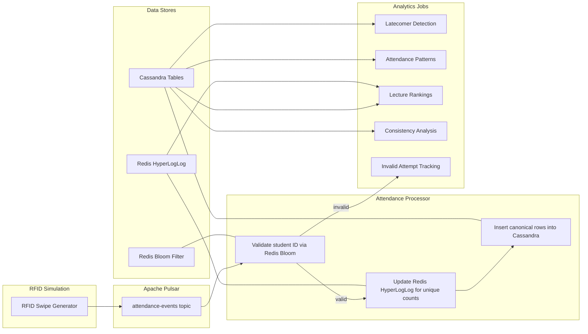

# Real-Time Student Attendance System

> **A production-style, real-time attendance pipeline using Apache Pulsar, Redis Bloom and HyperLogLog, Apache Cassandra, and Python.**

---

### 1) Executive Summary

This project implements a **real-time student attendance tracking system** that simulates RFID swipes, validates them at scale, persists normalized records, and generates analytics such as **unique attendees per lecture**, **latecomer detection**, and **attendance patterns**.

**Why it matters:** Traditional attendance capture is brittle and batch-oriented. This system demonstrates how to design a **streaming, fault-tolerant, and scalable** pipeline suitable for campuses or enterprises.

**Core pipeline:**
1. **Producer (Python):** Simulates RFID swipe events and publishes to **Apache Pulsar**.
2. **Processor (Python):** Consumes events, validates **student_id** with **Redis Bloom**, updates **HyperLogLog** for unique counts, and writes canonical records to **Cassandra**.
3. **Analytics (Python):** Reads Cassandra and Redis to derive insights (latecomers, patterns, rankings, consistency, invalid attempts).

---

### 2) Architecture Diagram



### Key Roles

- **Apache Pulsar** – durable, horizontally scalable pub/sub for event ingress; supports shared subscriptions, acknowledgements, and back pressure.  
- **Redis** – Bloom Filter validates student existence, HyperLogLog tracks unique attendees per lecture and date.  
- **Cassandra** – write-optimized, partitioned storage for time-series attendance events and queries like *by lecture* or *by date*.  

---

### 3) Tech Stack & Justification

| Component        | Choice              | Why it fits                                                                 |
|------------------|---------------------|-----------------------------------------------------------------------------|
| **Ingest**       | Apache Pulsar       | Segregated storage & compute via BookKeeper, multi-tenancy, flexible subs   |
| **Fast validation** | Redis Bloom      | Low-memory membership test with small false positive rate                   |
| **Unique counts** | Redis HyperLogLog  | Tiny memory footprint for approximate distinct per lecture per day          |
| **Storage**      | Apache Cassandra    | High write throughput, linear scalability, query-first data modeling        |
| **Language**     | Python              | Mature clients for Pulsar, Redis, Cassandra; fast prototyping environment   |


### 4) Event Model & Keys

**Event schema JSON**

```json
{
  "event_id": "d82e3a4e-2c21-4a5a-a6bb-70e8c12f66c5",
  "student_id": "S123456",
  "lecture_id": "CS101-L1",
  "gate_id": "GATE-02",
  "timestamp": "2025-03-19T09:05:12Z",
  "action": "enter"
}
```


**4.2 Redis Keys**

- **Bloom Filter:** `bf:students` (capacity = 100000, error_rate = 0.01)  
- **HyperLogLog:** `hll:unique:<lecture_id>:<YYYY-MM-DD>`  
  - Example: `hll:unique:CS101-L1:2025-03-19`

---

### 5) Cassandra Data Modeling

**5.1 Keyspace**

```sql
CREATE KEYSPACE IF NOT EXISTS attendance
WITH replication = {'class': 'SimpleStrategy', 'replication_factor': 1};
```

**5.2 Tables**

Canonical events, partitioned by lecture and day

```sql
CREATE TABLE IF NOT EXISTS attendance.events_by_lecture_day (
  lecture_id   text,
  day          date,
  ts           timestamp,
  student_id   text,
  gate_id      text,
  action       text,
  event_id     uuid,
  PRIMARY KEY ((lecture_id, day), ts, student_id)
) WITH CLUSTERING ORDER BY (ts ASC);
```

Alternate query by student and day

```sql
CREATE TABLE IF NOT EXISTS attendance.events_by_student_day (
  student_id   text,
  day          date,
  ts           timestamp,
  lecture_id   text,
  gate_id      text,
  action       text,
  event_id     uuid,
  PRIMARY KEY ((student_id, day), ts, lecture_id)
) WITH CLUSTERING ORDER BY (ts ASC);
```

## 6) omponent Design

**6.1 Data Generator** — `data_generator.py`
- Creates synthetic IDs and timestamps.  
- Publishes events to Pulsar topic **`attendance-events`** with batching enabled.  
- Configurable parameters: emit rate (events/sec), student population size, and late percentage to simulate tardiness.  
- Can preload **Redis Bloom** with valid student IDs.  

**6.2 Attendance Processor** — `attendance_processor.py`
- Pulsar consumer on **`attendance-events`** with subscription type = **shared**.  
- **Validation Path:**  
  - Check membership with `BF.EXISTS bf:students <student_id>`.  
  - If **false** → mark as invalid and optionally publish to **`attendance-invalid`**.  
  - If **true** → proceed to counting & persistence.  
- **Counting Path:**  
  - Add student to HLL: `PFADD hll:unique:<lecture_id>:<day> <student_id>`.  
- **Persistence Path:**  
  - Insert canonical rows into Cassandra:  
    - `events_by_lecture_day`  
    - `events_by_student_day` (optional for queries by student).  
- **Reliability:**  
  - Ack only after successful Redis + Cassandra writes.  
  - Negative ack on failure triggers redelivery.  
  - Optional idempotency via `event_id`.  

**6.3 Analytics** — `attendance_analysis.py`
- **Latecomer Detection:** flag students with `ts > lecture_start_time + grace_period`.  
- **Patterns:** aggregate by day-of-week; compute mean/median counts.  
- **Top Lectures:** rank by unique daily counts (from HLL) or by raw event counts.  
- **Consistency:** find students with attendance rate ≥ threshold across N sessions.  
- **Invalid Attempts:** report invalid swipes grouped by gate or time.  


### 9) Streaming Joins and Watermarks (Spark)

- **Micro-batch trigger:** e.g., `processingTime=30s` for near real-time updates.  
- **Event-time windows:** e.g., 30-minute sliding windows with 5-minute slide to align heterogeneous streams.  
- **Watermarking:** e.g., `withWatermark("event_time", "20 minutes")` to bound state and tolerate late data.  
- **Stateful processing & checkpointing:** ensures fault tolerance with **exactly-once semantics** when coupled with Kafka offsets.  

---

### 8) Online Feature Engineering

- **Rolling statistics:** mean, median, max of flow, speed, occupancy within the window.  
- **Lags & deltas:** \( flow_t - flow_{t-1} \), capturing trend and acceleration.  
- **Weather impact:** features like `precip_avg`, `wind_avg`, plus interaction terms (e.g., \( occ\_avg \times precip\_avg \)).  
- **Incident features:** severity, blocked lanes, time since incident.  
- **Edge features:** map station pairs → road segments for routing.


### 9) Running the System

**9.1 Prerequisites**
- Python **3.8+**  
- **Docker** (recommended)  
- Services: **Pulsar**, **Redis Stack**, **Cassandra**  

---

**9.2 Start Services (Docker)**

```bash
# Pulsar standalone
docker run -d --name pulsar -p 6650:6650 -p 8080:8080 apachepulsar/pulsar:latest bin/pulsar standalone

# Redis Stack
docker run -d --name redis -p 6379:6379 redis/redis-stack-server

# Cassandra
docker run -d --name cassandra -p 9042:9042 cassandra:latest
```
**9.3 Python Environment**

```bash
python -m venv .venv && source .venv/bin/activate
pip install -r requirements.txt
```
**9.4 Configuration Example — attendance_system/config/config.py**

```bash
PULSAR_SERVICE_URL = "pulsar://localhost:6650"
PULSAR_TOPIC = "attendance-events"
PULSAR_SUBSCRIPTION = "attendance-sub"

REDIS_URL = "redis://localhost:6379/0"
BLOOM_KEY = "bf:students"
BLOOM_ERROR_RATE = 0.01
BLOOM_CAPACITY = 100_000

CASSANDRA_CONTACT_POINTS = ["127.0.0.1"]
CASSANDRA_KEYSPACE = "attendance"
```

**9.5 Run**

```bash
# 1) Generate simulated events
python attendance_system/src/data_generator.py

# 2) Start processor in another terminal
python attendance_system/src/attendance_processor.py

# 3) Run analytics
python attendance_system/src/attendance_analysis.py
```

### 10) Operations and Observability

- **Structured logging** for sends, receives, Redis and Cassandra actions, acknowledgements, and redeliveries.  
- **Back pressure** handled via Pulsar consumer flow control and producer batching.  
- **DLQ (Dead Letter Queue):** optional for invalid or poison events.  
- **Throughput knobs:**  
  - Producer batch size and linger ms  
  - Consumer prefetch size  
  - Redis pipelines  
  - Cassandra batch writes (used sparingly)  

---

### 11) Trade-offs and Alternatives

- **Pulsar vs Kafka:** Pulsar’s multi-tenancy and BookKeeper separation vs Kafka’s simpler operations in single-tenant mode. Choose based on org expertise and tenancy needs.  
- **Bloom vs Set:** Bloom provides **O(1)** membership checks with constant memory and controlled false positives; Redis Set offers exactness at higher memory cost.  
- **HyperLogLog vs Exact Counting:** HLL uses tiny memory with ~1–2% relative error; exact per-lecture distinct sets can grow extremely large.  
- **Cassandra vs Relational DB:** Cassandra excels at write-heavy, time-series, query-first design; relational DBs may bottleneck at scale unless sharded.  

---

### 12) Security, Reliability, Data Quality

- **Security:** Use Pulsar auth (JWT), Redis auth, and Cassandra credentials via environment variables.  
- **Idempotency:** Deduplicate by `event_id`; for example, Redis `SETNX event:<uuid>` with TTL.  
- **Schema Evolution:** Add a `schema_version` field in the event schema to support forward compatibility.  
- **Time Normalization:** Emit **UTC timestamps** and normalize to `day` within the processor.  

### 13) Sample Queries Cassandra and Redis

```sql
-- By lecture and day ordered by time
SELECT * FROM attendance.events_by_lecture_day
 WHERE lecture_id='CS101-L1' AND day='2025-03-19';

-- Last N events for a student today
SELECT * FROM attendance.events_by_student_day
 WHERE student_id='S123456' AND day='2025-03-19'
 ORDER BY ts DESC LIMIT 50;
```

### 16) Project Structure

```text
attendance_system/
├── config/
│   └── config.py
├── src/
│   ├── data_generator.py
│   ├── attendance_processor.py
│   └── attendance_analysis.py
├── requirements.txt
└── README.md
```


